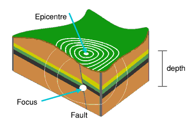

## Paper crumpling

#### :fire::fire::fire: (_Optional_): Another length scale
Repeat the pre-creased experiment for a different imposed length scale (e.g., smaller triangles).
Plot your result on top of the larger-triangle case, and assess whether you find a distribution of crackling energies consistent with the smaller imposed crease size.

#### :fire::fire::fire: (_Optional_): The Ultimate Crumpler  :page_with_curl: :wrench:

While I am sure you are carefully crumpling the paper as evenly as possible and likely did not notice a significant difference between different crumplers, hand crumpling is imprecise, irreproducible and introduces a length scale of the system proportional to the size of the crumpler's hand.

Let’s try to create an apparatus that can reproducibly crumple paper between trials.
An example of this could be using two cups of similar size and taping the article to the lids; the crumpling would then be generated by slowly rotating the cups in opposite directions, applying a uniform shear force to the paper.

Using your device repeat the analysis and compare your results with simply crumpling by hand.
Does the device yield a wider distribution of events?

#### :fire::fire::fire: (_Optional_): Universality
Recall the concept of universality from lectures, where diverse systems display similar emergent macroscopic behavior.

Discuss within your group what you expect to change about the event-energy distribution after making each of the following modifications to the experimental details of the crumpling experiment above:

1. __Recording duration__. Does a longer or shorter recording duration change the distribution of event energies.
2. __Paper type__. Repeat the experiment with a different type of paper (thickness, material, ...)
3. __Hand size/shape, crumpling technique__. Repeat with a different person or crumpling strategy.

Pick a modification from the three categories above, and repeat the experiment making this modification.
Use `hold('on')` to plot both the original experiment and your modification on the same plot.
How did the experimental change affect your results?

### :fire::fire::fire: (_Optional_): Universality
Recall the concept of universality from lectures.

In this tutorial, we found a similar distribution of events across multiple decades of scale, in both earthquakes and paper crackling, despite both systems having vastly different physics.
Do earthquakes and paper crackling belong to the same universality class?

---

## Tectonic Rubbing
The Earth responds with violent and intermittent earthquakes as two tectonic plates rub past one another.
The energy radiated by all earthquakes in 1995 is contained in the file `earthquakes.wav`.
Can you discern a 'crackle' (indicative of a scale-free distribution) from listening to the file?
(_Hint_: You can slow down the audio playback, e.g., by setting `fs = 2205`).

Calculate the distribution of earthquake magnitudes.

You should find a power-law, as earthquakes come in a wide range of sizes, from common unnoticeable trembles to rare catastrophic events.
This relationship is called the Gutenberg–Richter law, which states that the earthquake magnitude scales with the logarithm of the magnitude of the earthquake.

:question::question::question:
What is the power-law exponent of the distribution of earthquake magnitudes?

<!-- and reproduce the two figures shown above. Upload your figures. -->
