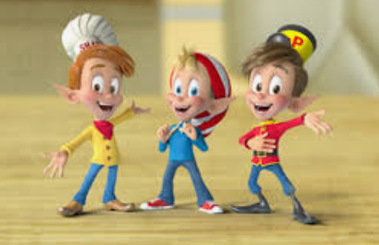
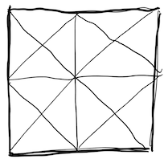
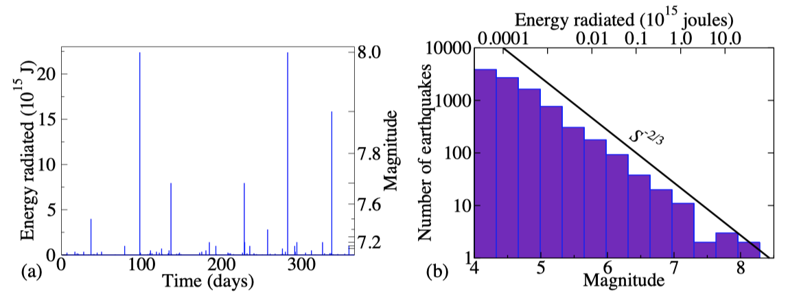
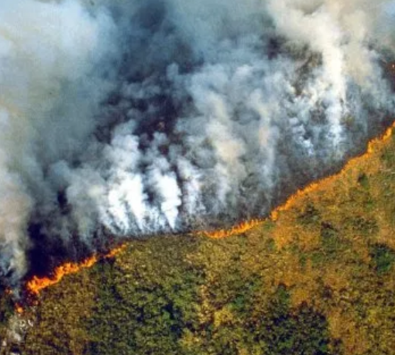
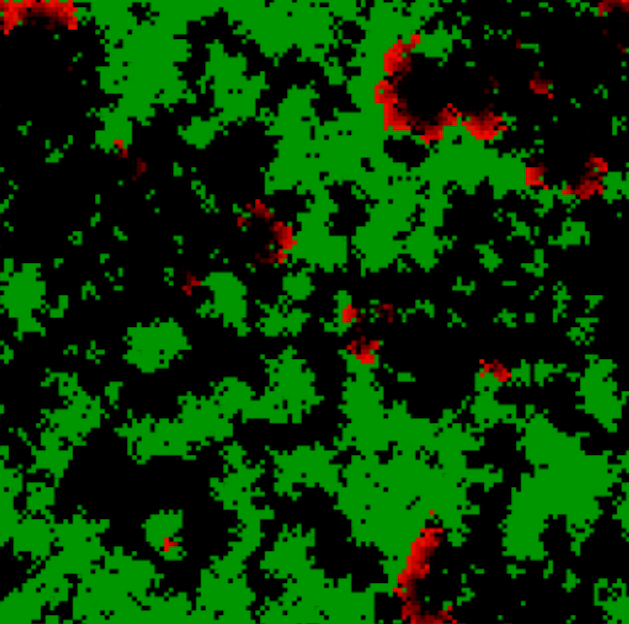

# Tutorial: Criticality

_Acknowledgement_: This tutorial is based on material developed by [Brandon Munn](https://github.com/Bmunn).

## Part 1: Snap, Crackle, and Pop

Most systems snap, crackle, or pop when driven slowly by an external force.
___Pops___ are lots of similarly sized discrete events, like popcorn popping as it is heated.
___Snaps___ are single significant events, like a snapped pencil.
Between these two limits, ___crackles___ are discrete events of a variety of sizes.

Many systems crackle, like the Earth responding with intermittent and variable earthquakes from the movement of the tectonic plates, magnetic domains aligning due to an applied magnetic field and the sound of fire crackling.



Physicists have studied the audio profile of crinkling of materials, which actually display some surprising and physically interesting properties, as described in this [New York Times article](https://www.nytimes.com/2000/06/01/us/no-hope-of-silencing-the-phantom-crinklers-of-the-opera.html) about the physics of disturbing others by unwrapping snacks in the theatre (you should recognize the reference to Universality in this passage):

> "The physics of wrappers turned out to be surprisingly complex, said Dr. Kramer, who found parallels in the different shapes that large protein molecules can assume in the human body and the properties of magnetic materials."

The crackling material we are investigating today is a material you would be very familiar with: paper.
Hold some paper to your ear (preferably not your lecture notes) and slowly move it and you will hear audible crackles due to the crumpling.

While paper might appear to be a boring system, we will see that it actually resembles the same types of microscopic random spatial processes we've been studying in lectures, that give rise to characteristic scale-free statistics at the macroscopic scale.

Some examples of physics papers on this topic:
* Acoustic emission from crumpling paper.
_Phys. Rev. E_ (1996).
[Link](https://journals.aps.org/pre/abstract/10.1103/PhysRevE.54.278).

#### Why does paper crackle?
Paper is a thin sheet which bends more easily than it stretches and naturally (and in response to stress) possesses a shape with zero Gaussian curvature almost everywhere.
However, when a paper is crumpled (experiences extreme stress), it forms permanent creases.
Crackles are produced from areas of paper buckling under applied stress.
You can imagine a microscopic model of paper in which the fibres that make up the sheet of paper vary in strength.
When you apply stress to the paper, it will preferentially form creases along contiguous stretches of the weaker fibres.
We've seen plenty of spatial models in lectures where these types of random microscopic processes yield scale-free macroscopic statistics.

Unfold a crumpled piece of paper, you will find the creases exhibit wildly varying lengths.
Like the sizes of the crumples, the crackles (discrete events) span many orders of magnitude in size.
In this tutorial, we may find that they form a scale-free power-law.


### Recording sound

Measuring the size of lots of individual creases is difficult, but luckily they leave an auditory signature.
To begin our investigation of crackling noise, we will use the `recordsound` function:
```matlab
numSeconds = 10;
[audioData,fs] = recordsound(numSeconds);
```
The audio will be saved as `audioData`, along with the sampling rate, `fs`.

Test this function out: record members of your group speaking for 10 seconds.
Then you can visualise the audio:
```matlab
f = figure('color','w');
plot((1:length(audioData))./fs,audioData)
xlabel('Time (s)')
ylabel('Amplitude')
```

Zoom in and inspect the structure.

Now record 10s of crumpling a piece of paper (slowly!) near the microphone, and plot it as above.
What are the differences between your speech and the paper crumpling?
Are the discrete crackles discernible as separate events in time, or do they overlap?
Is there any evidence paper may crackle (instead of popping or snapping)?

Discuss with your group what distribution of event sizes you expect.

### Discerning crackles

To adequately piece together a scale-free distribution of events, we need many samples of different events.
Through experimenting, we have found that you will need around 40s of paper crumpling to get adequate statistics.
To ensure the microphone can detect each individual crackle, try to crumple your paper slowly to minimise overlapping events.

The energy of a crackle is proportional to its amplitude squared.
The `energyCalc` function performs two steps:
1. Identify crackling events, which we estimate to occur when there is a local maximum in time, implemented using the `findpeaks` function.
2. Calculate the energy of each event as its amplitude squared.

Use `energyCalc` to process your recorded audio into a set of event energies, `E`.

We can now test for evidence of scale-free distribution of event sizes, `E`!
Calculate the histogram of energy crackles:
```matlab
tbl = tabulate(E);
f = figure('color','w');
plot(tbl(:,1),tbl(:,2),'ok')
```
What do you notice?

Now plot the same histogram on a log-log scale.
When plotting on log-log axes, it is good practice to use logarithmically spaced bins.
This can be achieved using the following commands:
```matlab
numBins = 25;
binEdges = logspace(log10(min(E)),log10(max(E)),numBins);
[N,binEdges] = histcounts(E,binEdges);
```

Plot the distribution determined by the counts, `N` on a log-log plot.

1. You may wish to plot as a function of `binCenters`, the mean of the edges of each bin.
2. Play with the number of bins, selecting a value that best captures the trade-off between spatial resolution of bins and noise of counts in individual bins.
3. You may wish to normalise the counts to probabilities: `Nnorm = N/sum(N)`.
4. You may wish to filter out some bad bins before plotting by constructing a logical index of bins to retain.
We are only interested in plotting bins containing at least one event (`keepBins = (N > 0)`).
The first bin is often contaminated by noise, and can be removed as `keepBins(1) = false`.

:question::question::question:
Does your histogram provide evidence for scale-free power-law statistics of paper crumpling events?
Upload your best result as a `.png`, noting any details of the paper, crumpling strategy, and recording length in the figure title (or as text annotations on the figure).

### Universality
Recall the concept of universality from lectures, where diverse systems display similar emergent macroscopic behavior.

Discuss within your group what you expect to change for each of the following changes to the experimental details of the crumpling experiment you performed above:

1. __Recording duration__. Does a longer or shorter recording duration, how does this change the histogram of event energies (Hint: use `hold('on')` when plotting for a visual comparison).
2. __Paper type__. Repeat the experiment with a different type of paper (thickness, material, ...)
3. __Hand size/shape, crumpling technique__. Repeat with a different person or crumpling strategy.

Pick a modification from the three categories above, and repeat the experiment making this modification.
How did this experimental change affect your results?
:question::question::question: Upload a figure showing the results of your first experiment and the results of your modification on the same plot.

### Scale invariance

Look at one of your crumpled pieces of paper.
Are all of the creases a similar length scale, or do you see a wide range of length scales?
How do you think these are related to loud scale-invariant cracks?

If the amplitude of crackles is proportional to the crease length of the buckled paper, how would you expect your amplitude plot to change with time?
Do you see this in your time plot?

Another way to test this idea is to impose a characteristic length scale, by pre-creasing our paper and trying to force crackles to result from these creases only.
Here is an example using triangular creases in the paper of a fixed size, imposing the desired length scale of creases along which cracks will occur:



Now when you crumple, make sure to crumple slowly such that the cracks are due to these areas buckling.

How do you explain the difference in crackles heard?
Do your results support your hypothesis?

:question::question::question:
Comment on the changes in the log-log distribution of event energies from your pre-creased paper and upload your plot.

:fire::fire::fire: (optional challenge)
Repeat this analysis for a different imposed length scale (e.g., smaller triangles).
Plotting your result on top of the larger-triangle case, assess whether you find a distribution of energies consistent with the smaller imposed crease size.

#### :question::question::question: Is paper sitting at a critical point?

In lectures, we learned about self-organised criticality.
Can you explain how the paper arrives at the critical point?
How does paper crackling resemble a self-organised critical system?

### Snap, crackle, and/or pop!
Now that you are knowledgeable about crackling noise, we can answer the question as old as father time himself: _do rice bubbles, snap, crackle, or pop?_
The sound file, `riceBubble.wav`, is a recording of rice bubbles recently after adding milk.


Load and listen to the file:
```matlab
[riceData,Fs] = audioread(fullfile('data','riceBubble.wav'));
sound(data,Fs);
```
Just from listening, what is your intuition?: _Snap_? _Crackle_? _Pop_?

Because the recording is quite noisy, you will need to set a minimum threshold for each event by editing the `findpeaks` command in `energyCalc`, setting `'MinPeakHeight'` to a small value (e.g., `0.04`).

Now take a look at the histogram of event energies in rice bubbles?
What can you conclude from these plots?

:question::question::question: Upload your plot.

### Tectonic Rubbing
The Earth responds with violent and intermittent earthquakes as two tectonic plates rub past one another.
`earthquakes.wav` is a sound file containing all earthquakes in 1995.
Listening to it, can you discern a crackle?
(_Hint_: slow down the audio playback by changing `fs = 2205`).




:question::question::question:
Calculate the histogram of earthquake magnitudes and reproduce the two figures shown above. Upload your figures.

You should find a power-law as earthquakes come in a wide range of sizes, from unnoticeable trembles to catastrophic events as the smaller earthquakes are much more common.
This relationship is called the Gutenberg–Richter law, which states the earthquake magnitude scales with the logarithm of the magnitude of the earthquake.

:question::question::question:
What is the exponent of your power-law? Upload your code and results.

### Universality

In this tutorial, we found a similar distribution of events across multiple decades of scale, in both earthquakes and paper crackling.
But both systems have vastly different micro and macroscopic details.

Recall the concept of universality from lectures.
Do you know why universality occurs?
How is universality useful for understanding different phenomena?
What are the advantages of studying toy models?

#### :fire::fire::fire: (Optional) Challenge: Dependence on Experimental Variables

While I am sure you are carefully crumpling the paper as evenly as possible and likely did not notice a significant difference between different crumplers, hand crumpling is imprecise, irreproducible and introduces a length scale of the system proportional to the size of the crumpler's hand.

Let’s try to create an apparatus that can reproducibly crumple paper between trials.
An example of this could be using two cups of similar size and taping the article to the lids; the crumpling would then be generated by slowly rotating the cups in opposite directions, applying a uniform shear force to the paper.

Using your device repeat the analysis and compare your results with simply crumpling by hand.
Does the device yield a wider distribution of events?


## Part 2: Self-organising forests :evergreen_tree::fire::evergreen_tree::fire::evergreen_tree::fire::evergreen_tree:

Despite the complexities in how forest fires propagate (different trees, landscapes, and temperature), forest-fires are actually scale-invariant.
That is, burn areas exhibit power-law statistics (there are many small fires and few large fires).



### A simple forest-fire model
In lectures, we learned that the theory of self-organised criticality can explain the ubiquity of scale-invariance in natural systems.
We played with a [simple, interactive forest-fire model](https://www.complexity-explorables.org/explorables/critically-inflammatory/) that we're now going to implement ourselves and do some quantitative numerics on.



One of the creators of this concept, Per Bak, developed a forest-fire model defined on a 2-dimensional spatial grid.

Initially, each site is randomly assigned to be a tree, a burning tree or empty.
The system is then updated (in parallel) according to the following rules:
1. _death_: A burning tree becomes an empty site in the next time-step;
2. _regrowth_: An empty site grows a tree with probability `p`, and
3. _burning_: A tree becomes a burning tree in the next time-step if at least one of its neighbours is burning.
4. _lighting strike_: A tree becomes a burning tree during a time step with probability `f` if no neighbour is burning (this rule was required for the system to become truly critical).

In this lab, we will examine the simple forest fire model, and demonstrate it is self-organised and critical, exhibiting self-similar behavior.

:fire::fire::fire: If you are up for the challenge and want to understand the mechanics of the model, go through the instructions in `ImplementingForestFire.md` and modify `forestFireModelEmpty` to build your own forest-fire model.

:snowflake::snowflake::snowflake: If you are running short on time, we have implemented the four rules in `forestFireModel`.
Have a look through it and make sure you understand how the rules have been implemented.


### Critical conditions on parameters

Within this model, an important criterion is that the lightning strikes at a rate `f`<<`p`, in this case, even though we parallel update, the burning of a cluster can be thought of as instantaneous, as long as `p` -> 0 (As `p` is the probability of a tree growing a small `p` ensures new trees do not grow at fire fronts).

Thus, the critical conditions are that `f`<<`p`<<1, and this can be physically interpreted as a separation of timescales, as the time in which a forest cluster burns down is much shorter than the time in which a tree grows, which again is much shorter than the time between two lightning strikes.


Considering the timescales that these phenomena occur within nature, discuss within your group whether you believe that this is a valid condition for simulating natural forest fires?

### Simulating forest-fire dynamics
In the original 1992 paper, Drossel and Schwabl simulated a grid-size of 250 x 250 over many hours, thankfully, computers are faster now and we can comfortably model on a 300 x 300 grid and in a regime much closer to criticality (smaller `p`) in a few minutes.


Now we will be using the `ForestFireModel` code provided (or written, for those of you who are on :fire::fire::fire:).

```matlab
ForestFireModel(Tmax, PG, PL, plotFlag, outputFlag):
```
Inputs:
* `Tmax`: the number of generations to be simulated.
* `PG`: a multiplier of the critical growth rate.
* `PL`: a multiplier of the critical lightning rate.
* `plotFlag`: whether to plot the forest fire model (green = trees, white = empty ground, red = fire),
* `outputFlag`: whether to output a 3d matrix (space, space, time).

### 

Let’s visualise the dynamics within the model at the critical point (`PG = 1`, `PL = 1`).
Set your model to run for 1000 generations, with the plot flag on.
At the critical point, we would expect to see a scale-free distribution of fire sizes.

Now examine the model when it is shifted from the critical point by decreasing the lightning probability:  `PL = 0.05` and increasing the lightning probability: `PL = 50`.

Discuss in your group the dynamics at these three regimes.

:question::question::question:
Remember, in the crackling noise experiment, the creases occur along the weakest fibres, which are scale-free. Discuss how the topographical structure of the forests (clusters of trees) at the critical point differ from `PL = 0.05` and `PL = 50`, are they homogenous, heterogeneous, or something in between (_Hint:_ Do we see any qualitative evidence of scale-invariance?).

### Demonstrating criticality
In this section, we will output the ongoing dynamics and analyse them to demonstrate that the model reaches a critical point quantitatively. Remember from crackling noise at a critical point, we observe scale-invariant dynamics. 

First, let's extend the number of generations to 5000 (or more if time permitting) to build sufficient statistics, and save the output in the variable `data` (ensuring `outputFlag = true`). Second, let's process the results using the `fireArea` function, which outputs the number of trees burned within each cluster of fire, as `treeBurn`.

:question::question::question: 
For each of the parameter regimes studied above (`PL = 0.05`, `PL = 1`, `PL = 50`), plot the resulting distribution of cluster sizes (in units of trees) on the same log-log axes. As with crackling noise, use logarithmically-spaced bins (setting a suitable number of bins, and filtering out empty bins as appropriate). Upload your code and graph (ensuring axes and the different regime histograms are labelled) and describe why the histograms differ when the lightning probability is below and above the critical point.

:question::question::question:
The histogram of natural forest fire sizes has an exponent of -1, estimate the histogram exponent of the forest-fire model at the critical point. Upload your code to estimate the critical exponent, and state the result.

Comment on whether your simulated estimate agrees with experimental predictions?
_Hint:_ You may wish to restrict the scale over which you perform your linear fit as some large outliers may have insufficient statistics due to the short simulation time.


### Learning from the model

Now that you are a world-leading expert on the dynamics of forest-fires, the Blue Mountains City Council has approached you and wants to know how to minimise large-scale fires. Your colleague from UNSW suggests the council should place more local fire-fighters during the bush-fire season to ensure more small fires are quickly extinguished.

:question::question::question: 
Is this the best advice? By extinguishing spot fires which regime does this resemble in the model. What would your advice be? (_Hint:_ Research the Yellowstone effect)

:fire::fire::fire:
The council are impressed with your work and have asked you to expand your model to incorporate fire-fighters and random-arsonists. Discuss and implement these two new features into the model.


### REFERENCES

* Bak, Chen, and Tang, [A forest-fire model and some thoughts on turbulence](https://www.sciencedirect.com/science/article/pii/037596019090451S), _Physics Letters A_, **147**, 297-300 (1990).
* Drossel, B. and Schwabl, F. (1992),
[Self-organized critical forest-fire model](https://doi.org/10.1103/PhysRevLett.69.1629).
_Phys. Rev. Lett._ __69__, 1629–1632.
* Grassberger, P. (2002),
[Critical behaviour of the Drossel-Schwabl forest fire model](http://iopscience.iop.org/article/10.1088/1367-2630/4/1/317/meta).
_New J. Phys._ __4__, 17.
